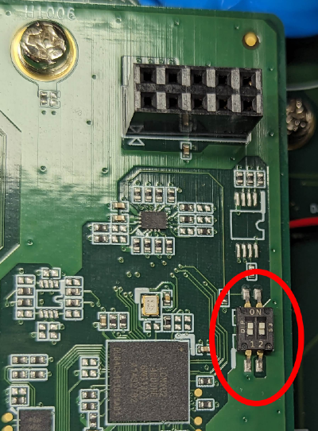

# rqx-release-sw
Public released software for ROScube-X series.

Please go to [release page](https://github.com/Adlink-ROS/rqx-release-sw/releases) to download.

The latest FPGA flash tool:

- fpga_flash_tool_0.9.0

The latest FPGA firmware:

- rqx590_0x24.vme

## FPGA Flash Tool

Currently, this tool only supports **RQX-59G** with `ADLINK GMSL` board and **RQX-59F** with `ADLINK FPDL` board.

You can download `check_io_board.py` from the release page to check which I/O board you are using now.

```bash
chmod +x check_io_board.py
sudo ./check_io_board.py
```


## RQX590 FPGA Firmware

### How to get version
```bash
i2cget -f -y 2 0x66 0x01
```

### How to flash

Please follow the instructions below to flash RQX590 FPGA:

1. Download and extract `rqx590_<ver>.vme.tgz` and `fpga_flash_tool_<ver>.tgz`

    ```bash
    tar zxvf fpga_flash_tool_0.9.0.tgz
    tar zxvf rqx590_0x24.vme.tgz
    cp rqx590_0x24.vme ./fpga_flash_tool_0.9.0/
    ```

2. Follow below commands to flash the FPGA:

    ```bash
    cd fpga_flash_tool_0.9.0
    chmod +x RQX590-JTAG.run
    sudo ./RQX590-JTAG.run -c rqx590_0x24.vme
    ```

    

3. Read the FPGA register 0x01, you will get the FPGA firmware version if flashed successfully.

    ```bash
    i2cget -f -y 2 0x66 0x01
    ```
    

    Note: If FPGA failed to flash, please make sure the DIP switches on the IO Board are turned on.
    
    
